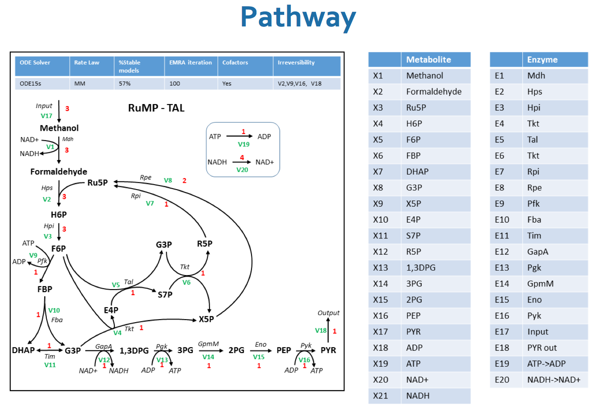
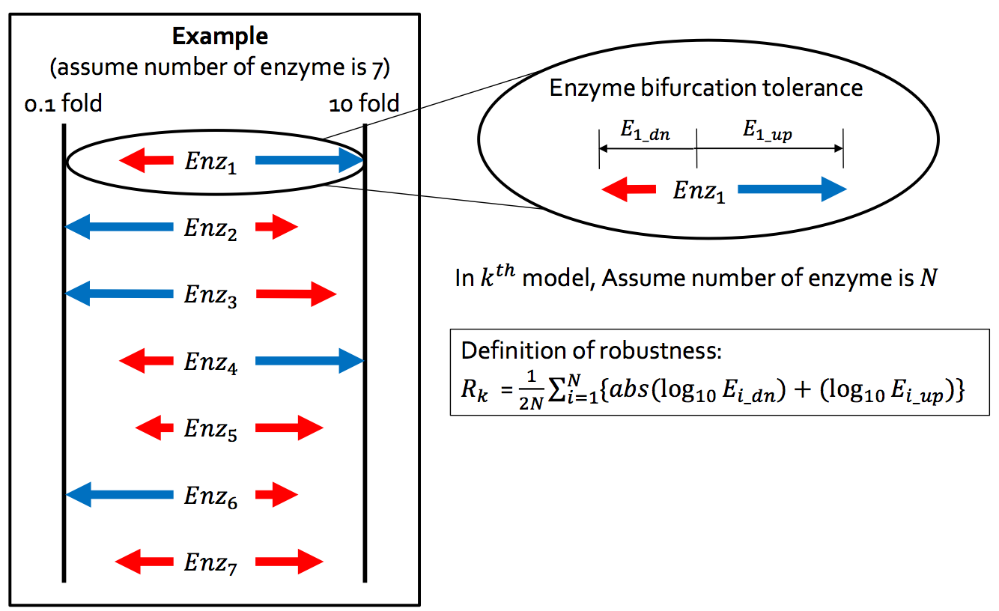

This work analyzes the influence of enzyme kinects to the robustness of a metabolic system(pathway), and provides insights on how to adjust system parameters. We use machine learning techniques to recognize bottleneck reactions and identify them as either positive or negative to system robustness by the correlation test. 
- This work is collaborated with [Metabolic Engineering and Synthetic Biology Laboratory, UCLA](http://www.seas.ucla.edu/liao_lab/team.html]) supervised by Prof. James C. Liao, who is the President of Academia Sinica from 2017
- A pilot project to analyze metabolic pathways in point of view of machine learning researchers
- The target pathway is related to CO2 fixation and produciton of fuels and chemicals, and that's what we are working on but not for public distribution yet

## Scenario
Accordingly, the above analysis make the search process more effective and efficient, and there is a real example: a parameter vector which yields robustness = 0.19 can be optimized to yield robustness = 0.32 by **only lowering Km of v4**, because we know 1) the 4th reaction is most crucial and 2) Km of v4 has negative effect to robustness. In other words, tuning the parameters in v4 would be the most **cost-effective** in terms of robustness, and tuning another parameter in any other reactions would not yield robustness > 0.32.

## Presentation Slides
<iframe src="//www.slideshare.net/slideshow/embed_code/key/qqzysWM3i1q9HE" width="595" height="485" frameborder="0" marginwidth="0" marginheight="0" scrolling="no" style="border:1px solid #CCC; border-width:1px; margin-bottom:5px; max-width: 100%;" allowfullscreen> </iframe> 
 <strong> <a href="//www.slideshare.net/secret/qqzysWM3i1q9HE" title="Using Machine Learning in Metabolic System Analysis: Explanation and Prediction" target="_blank">Using Machine Learning in Metabolic System Analysis: Explanation and Prediction</a> </strong> from <strong><a href="https://www.slideshare.net/ssuser950871" target="_blank">Chun-Ming Chang</a></strong> 

## Dataset and Methodology
Our dataset is simuldated by[Metabolic Engineering and Synthetic Biology Laboratory](http://www.seas.ucla.edu/liao_lab/team.html]) in UCLA lead by Prof. James C. Liao (currently the President of Academia Sinica). The selected pathway is as follows.

We have 86 tunable parameters in this pathway and total number of simulated models is 116,911.

## Definition of robustness
A "robust" metabolic pathways: if a setting of system parameters can meet the [Michaelis–Menten kinetics](https://en.wikipedia.org/wiki/Michaelis%E2%80%93Menten_kinetics) and reach steady-state concentrations of all substrates, the parameter setting is one of the feasible solutions of this pathway.

We quantify the **enzyme-wise robustness as the tolerance for individual enzyme perturbations**. For one enzyme, we estimate three terms below.
- Enz_up   = Enzyme tolerance when going up (overexpression)
- Enz_down = Enzyme tolerance when going down (knockdown)
- Enzyme-wise robustness = 0.5*abs(log10(Enz_up)) + 0.5*abs(log10(Enz_down))
- **System-wise robustness** = summation of each enzyme-wise robustness.

* Note that **1)** Enz_up and Enz_down are estimated by simulation and **2)** The enzyme perturbation is done by overexpression from 1 to 10 folds and knockdown from 1 to 0.1 fold.

## Interactions among reactions
We formulate the interactions among reactions in arithmetic ways of addition, substraction, multiplicaiton, and division. Moreover, we categorize all interactions into two types: intra-reaction and inter-reaction. 

- **Intra-reaction**: create features by parameters in same reaction. For example, v4's Km multiplies v4's Vmax.
capture the interaction among reacions, 
- **Inter-reaction**: create features by parameters among different reactions. For example, v4's Km divides v5's Km.

## Results

## Abstract
This work emphasizes on how **enzyme** kinects affect the robustness of a metabolic system(pathway) and tries to explain the underlying reasons. An enzyme may act upon some specific molecules called substrates and turn them into different molecules known as products. Enzyme rates depend on solution condition and substrate concentration. 

Enzymes are need in almost all metabolic systems, and 
In a metabolic pathway, one enzyme takes the product of another enzyme as a substrate. After the catalytic reaction, the product is then passed on to another enzyme. Sometimes more than one enzyme can catalyze the same reaction in parallel; this can allow more complex regulation: with, for example, a low constant activity provided by one enzyme but an inducible high activity from a second enzyme.

The molecules upon which enzymes may act are called substrates and the enzyme converts the substrates into different molecules known as products.

## Appendix: Enzyme in Metabolic Pathways

In a metabolic pathway, one enzyme catalyzes a chemical reaction and turns substrates, which is usually the products of another enzyme, into products. Metabolic pathways are typically complex and various interactions among reactions lead to the difficulty of efficiently find a configuration of parameters to make pathways robust. 

Enzyme rates depend on solution conditions and **substrate concentrations**. For a given enzyme concentration and for relatively low substrate concentrations, the reaction rate increases linearly with substrate concentration; the enzyme molecules are largely free to catalyse the reaction, and increasing substrate concentration means an increasing rate at which the enzyme and substrate molecules encounter one another.

However, at relatively high substrate concentrations, the reaction rate asymptotically approaches the **theoretical maximum**; the enzyme active sites are almost all occupied and the reaction rate is determined by the **intrinsic turnover rate** of the enzyme. 

- The substrate concentration midway between these two limiting cases is denoted by Km.
- The theoretical maximum reaction rate is denoted by Vmax.
- The intrinsic turnover rate is denoted by Kcat.

| Parameter | Selection |
|-----------|-----------|
|  |  |

