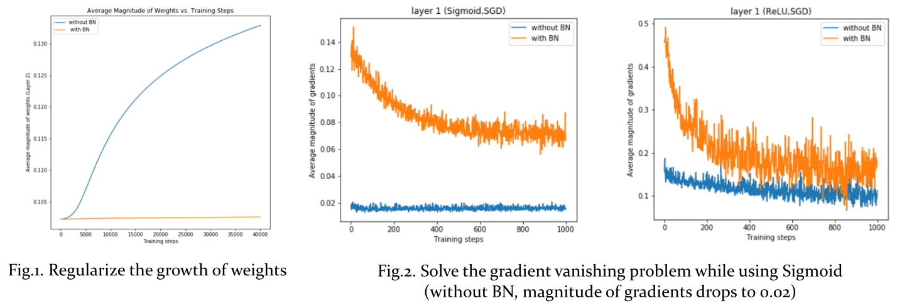

Since **batch normalization** (BN) is regarded as the necessary component in many well-known network architectures, this work aims at investigating that **why batch normalization works so well** in both theoretical and experimental viewpoints.
- The **1st** place in peer reviews (score: 14.6/15, novelty: 1.6/2, 16.2/17)
- The **2nd** place in the oral presentation voted by audience
- Github repository >> [https://github.com/NothingHard/MLDS_final_2017](https://github.com/NothingHard/MLDS_final_2017)

*score(15)=originality(5)+reproducibility(5)+quality(5) with bonus=novelty(2)

## Abstract
BN is designed to reduce internal covariate shift problem in training networks. In this project, we have validated the effectiveness of BN to accelerate network training and improve performance. Furthermore, the experimental results demonstrate the following effects:
- BN does **regularize** the growth of weights (verifed by checking weight distribution)
- BN does **tackle gradient vanishing** problem (verified by monitoring gradient's magnitude)
- BN does **improve gradient flows** of network (verified by examining the isometry of backward propagation)
- We compare the distribution of **singular values of layer's Jacobian** to verify the claim that BN leads to better isometry when error propagates through networks.

## Presentation Slides
<iframe src="//www.slideshare.net/slideshow/embed_code/key/GDTNdQPxwOQ02I" width="595" height="485" frameborder="0" marginwidth="0" marginheight="0" scrolling="no" style="border:1px solid #CCC; border-width:1px; margin-bottom:5px; max-width: 100%;" allowfullscreen> </iframe> 
 <strong> <a href="//www.slideshare.net/ssuser950871/why-batch-normalization-works-so-well" title="Why Batch Normalization Works so Well" target="_blank">Why Batch Normalization Works so Well</a> </strong> from <strong><a href="https://www.slideshare.net/ssuser950871" target="_blank">Chun-Ming Chang</a></strong> 

## Motivation: Why Needs Batch Normalization?
Batch normalization is to accelerate network training by reducing internal covariate shift. **Internal covariate shift** is the change in the distribution of network activations due to the change in network parameters during training. By whitening the inputs to each layer, we would take a step towards achieving the fixed distributions of inputs that would remove the ill effects of the internal covariate shift.

The full whitening of each layer’s inputs is costly and not everywhere differentiable, so, in batch normalization, there are two necessary simplifications:
1. instead of whitening the features in layer inputs and outputs jointly, **independently normalize** each scalar feature
2. use **mini-batches statistics** rather than global statistics in stochastic gradient training

## Experimental Study

We conduct experiments on MNIST using a fully connected neural network with 3 layers to validate the claims made by the authors of the original BN paper, and the authors point out that

1. BN regularizes the model
=> Fig.1. implies that BN does limit the growth of magnitude of weights over training steps. 

2. BN solves the gradient vanishing problem
=> Fig.2. shows that in use of **Sigmoid, with BN**, the average magnitude of gradients of the first hidden layer holds up to 0.1 (the case of **Sigmoid, without BN** is 0.02). 

3. BN benefits gradient flows through network
=> We restore the distribution of singular values of layer's Jacobian in every training steps. According to the following GIF(s), we found that BN helps shift the distribution of **singular values of layer's Jacobian** closer to one, and this keeps good **isometry** when error propagates through the network.

## Which the following factors affect the effect of BN most?

| Experiment | Alternatives |
|------------|--------------|
| 1. Activation function |  lrelu, relu (default), sigmoid, softplus, tanh |
| 2. Optimizer  | Adam (default), SGD |
| 3. Batch size | 4, 16, 64 (default), 256 |

- Exp1: BN benefits the performance no matter which activation functions are used, and BN affects the case of Sigmoid most.
- Exp2: BN accelerates network training no matter the choice of activation functions and optimizers. It is interesting that **ReLU-SGD, with BN** is similar with **ReLU-Adam, without BN** and reveals that BN is as effective as the sophisticated optimization algorithm like Adam.
- Exp3: BN deteriorates performance when batch size is small because the statistics of a small batch are not representive enough.

