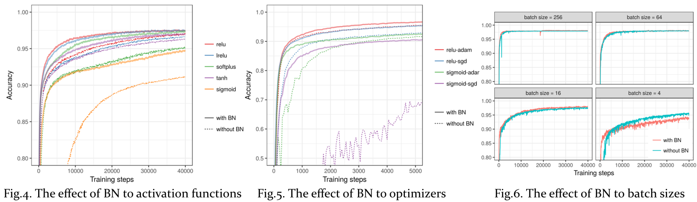

Since **batch normalization** (BN) is regarded as the necessary component in many well-known network architectures, this work aims at investigating that **why batch normalization works so well** in both theoretical and experimental viewpoints.
- The 1st place by peer reviews (original score: 16.2/17)
	- originality(5), reproducibility(5), quality(5), novelty(2, bonus)
- The 2nd place in the oral presentation by audience votes
- Github repository >> [https://github.com/NothingHard/MLDS_final_2017](https://github.com/NothingHard/MLDS_final_2017)

## Abstract
BN is designed to reduce internal covariate shift problem in training networks. In this project, we have validated the effectiveness of BN to accelerate network training and improve performance. Furthermore, the experimental results demonstrate the following effects:
- BN does **regularize** the growth of weights (verifed by checking weight distribution)
- BN does **tackle gradient vanishing** problem (verified by monitoring gradient's magnitude)
- BN does **improve gradient flows** of network (verified by examining the isometry of backward propagation)
- We compare the distribution of **singular values of layer's Jacobian** to verify the claim that BN leads to better isometry when error propagates through networks.

## Why Needs Batch Normalization?
Batch normalization is to accelerate network training by reducing internal covariate shift. **Internal covariate shift** is the change in the distribution of network activations due to the change in network parameters during training. By whitening the inputs to each layer, we would take a step towards achieving the fixed distributions of inputs that would remove the ill effects of the internal covariate shift.

The full whitening of each layer’s inputs is costly and not everywhere differentiable, so, in batch normalization, there are two necessary simplifications:
1. instead of whitening the features in layer inputs and outputs jointly, **independently normalize** each scalar feature
2. use **mini-batches statistics** rather than global statistics in stochastic gradient training

## Experimental Study

We conduct experiments on MNIST using a simple fully connected neural network (3 layers). 

| Parameter | Selection |
|-----------|-----------|
|  |  |

## Validation of the claims made by the authors
### 1. BN regularizes the model
...
### 2. BN solves the gradient vanishing problem
...

### 3. BN benefits gradient flows through network
- The distribution of singular values of layer's Jacobian

## Which the following factors affect the effect of BN most?

| Experiment | Alternatives |
|------------|--------------|
| 1. Activation function |  lrelu, relu sigmoid, softplus, tanh |
| 2. Optimizer  | Adam, SGD |
| 3. Batch size | 4, 16, 64, 256 |

## 

## Slideshare
<iframe src="//www.slideshare.net/slideshow/embed_code/key/GDTNdQPxwOQ02I" width="595" height="485" frameborder="0" marginwidth="0" marginheight="0" scrolling="no" style="border:1px solid #CCC; border-width:1px; margin-bottom:5px; max-width: 100%;" allowfullscreen> </iframe> 
 <strong> <a href="//www.slideshare.net/ssuser950871/why-batch-normalization-works-so-well" title="Why Batch Normalization Works so Well" target="_blank">Why Batch Normalization Works so Well</a> </strong> from <strong><a href="https://www.slideshare.net/ssuser950871" target="_blank">Chun-Ming Chang</a></strong> 

