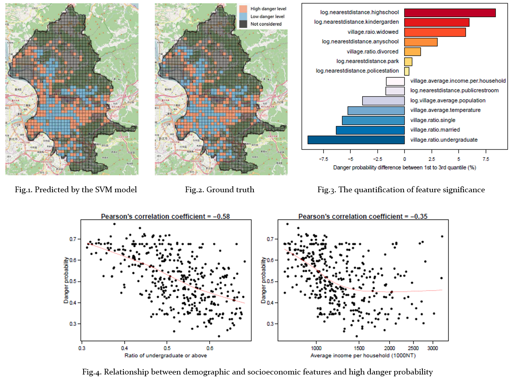

<a href='http://nothinghard.github.io/files/ACIIDS17_cmc.pdf'>Download paper here</a>

## Abstract

- In this paper, we explore underlying relationships between crimes and various geographic, demographic and socioeconomic factors. We collect 25 datasets from publicly available sources and apply machine learning techiques to build a data-driven model that is capable of characterizing crime occurrences.

- Our results demonstrate the effectiveness of identifying potentially dangerous spots (AUC=0.756). Most importantly, we quantify the significance of each feature and reveal the underlying causes of crime occurrence. This result is presented to the Taipei City officials for future government policy desicion making.

## Data preprocessing

- Apply the **grip thematic mapping** techique to draw a grid over Taipei that creates 500 meters by 500 meters cells. The reasons are two fold: (1) ensure our boundaries _enclose the same area_ because of too large variance in the area of villiages; (2) control the _granularity_ of datasets.
- Define a crime danger index by normalizein the number of crime occurrences by the number of building within each cell in order to _avoid spatial autocorrelation_.

## Feature selection
- Use a _feature ranking_ generated from random forests as initial feature selection process.
- Perform a _Pearson's correlation test_ to identify correlation between each feature, as well as with the response variable to select statistically significant features and _avoid collinearity among features_.

## Model construction
- We train a variety of binary classifiers with the training data using 5-fold cross-validation, including logistic regression, naive bayesian, decision tree, random forest and support vector machine with different kernels.
- For each classifier, we determine its optimal set of features by using _SVM-based recursive feature elimination_ (RFE) algorithm.

