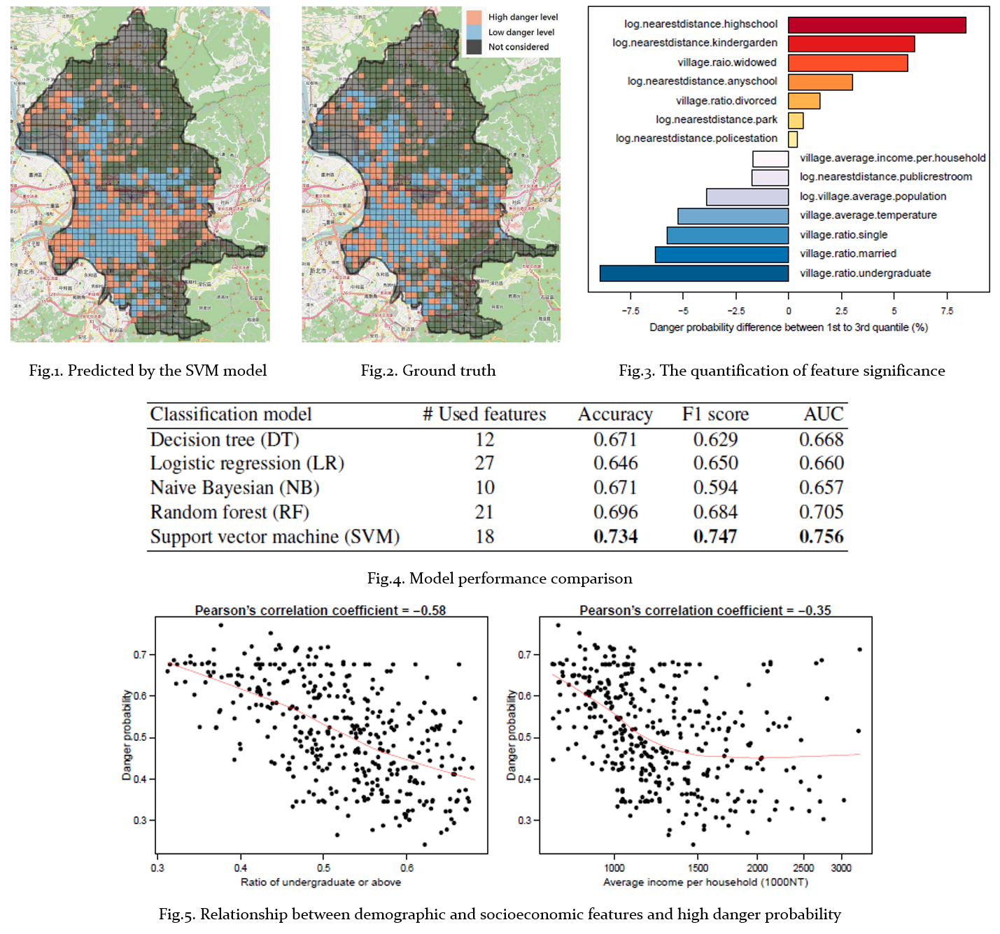

<a href='http://nothinghard.github.io/files/ACIIDS17_cmc.pdf'>Download paper here</a>

Our results demonstrate the effectiveness of identifying potentially dangerous locations and also provide insights into interactions between key geographic, demographic and socioeconomic factors and city crime rate. Furthermore, we quantify the significance of each feature and reveal the underlying causes of crime occurrence. This result is presented to the Taipei City officials for future government policy desicion making.

## Data preprocessing

- Apply the *grip thematic mapping* techique to draw a grid over Taipei that creates 500 meters by 500 meters cells. The reasons are two fold: (1) ensure our boundaries enclose the same area because of too large variance in the area of villiages; (2) control the granularity of datasets.
- Define a crime danger index by normalizein the number of crime occurrences by the number of building within each cell in order to avoid spatial autocorrelation.

## Feature selection
- Use a feature ranking generated from random forests as initial feature selection process.
- Perform a Pearson's correlation test to identify correlation between each feature, as well as with the response variable to select statistically significant features and avoid collinearity among features.

## Model construction
- We train a variety of binary classifiers with the training data using 5-fold cross-validation, including logistic regression, naive bayesian, decision tree, random forest and support vector machine with different kernels.
- For each classifier, we determine its optimal set of features by using SVM-based recursive feature elimination (RFE) algorithm.

# Results
-  Our results demonstrate the effectiveness of the proposed methodology by providing insights into interactions between key geographic, demographic and socioeconomic factors and city crime rate.
