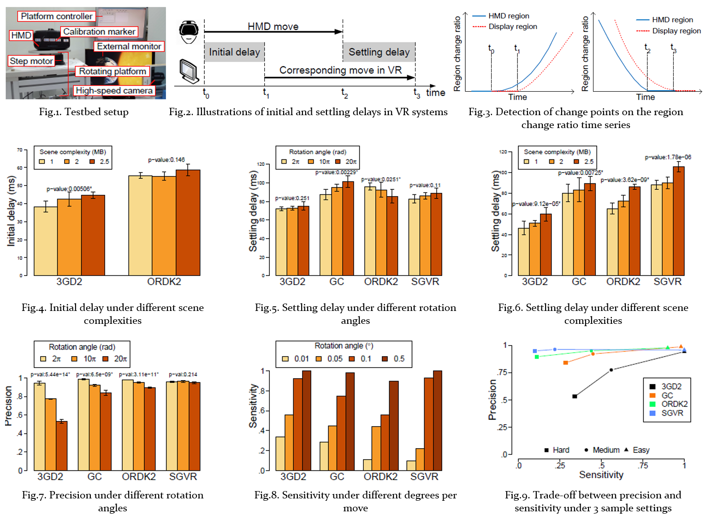

## Abstract
- We propose **the very first non-intrusive measurement methodology** for quantifying the performance of commodity Virtual Reality (VR) systems.
- Our methodology considers the VR system under test as a black-box and works with **any** VR applications and HMDs.
- We also quantify several variations of the **timing** and **positioning** accuracy metrics, which were not discussed in the literature.
- Several consumer-grade products, like Oculus Rift and Google CardBoard, are measured, and we make several observeations:
	1. 3D scene complexity affects the timing accuracy the most;
	2. most VR systems implement the dead reckoning algorithm, which incurs a non-trivial correction latency after incorrect predictions;
	3. there exists an inherent trade-off between two positioning accuracy metrics: precision and sensitivity;

## Definition

## Methodology

## Deck-reckoning

## Results
- We make several observations:
	1. 3D scene complexity affects the timing accuracy the most;
	2. most VR systems implement the dead reckoning algorithm, which incurs a non-trivial correction latency after incorrect predictions;
	3. there exists an inherent trade-off between two positioning accuracy metrics: precision and sensitivity;

<a href='http://nothinghard.github.io/files/ACM_MM16_cmc.pdf'>Download paper here</a>