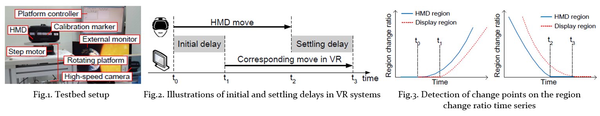
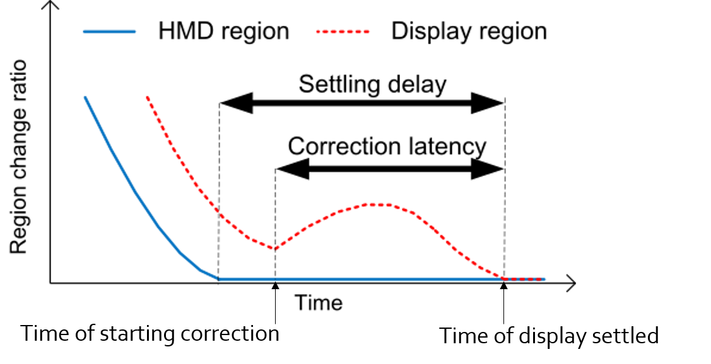
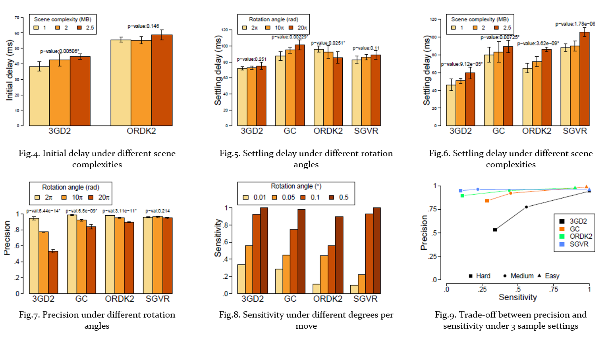

## Abstract
- We propose **the very first non-intrusive measurement methodology** for quantifying the performance of commodity Virtual Reality (VR) systems.
- Our methodology considers the VR system under test as a black-box and works with **any** VR applications and HMDs.
- We also quantify several variations of the **timing** and **positioning** accuracy metrics, which were not discussed in the literature.
- Several consumer-grade products, like Oculus Rift and Google CardBoard, are measured, and we make several observeations:
	1. 3D scene complexity affects the timing accuracy the most;
	2. most VR systems implement the _dead reckoning algorithm_, which incurs a non-trivial correction latency after incorrect predictions;
	3. there exists an inherent trade-off between two positioning accuracy metrics: precision and sensitivity;

## Methodology
- The measurement testbed comprises a number of components (Fig.1.):
	1. a rotating platform to emulate head (HMD) movements;
	2. an external display that mirrors the view in the HMD;
	3. a high-speed camera that captures both the HMD device and the HMD view;
- Post-processing steps
	1. Leverage the sound made by the rotating platform to cut the video record into N clips, and each video clip is converted into grayscale;
	2. For each video clip, we define the average of the first _K_ frame as _initial reference frame_ and that of the last _K_ frame as the _settled reference frame_;
	3. Two regions are defined: (1)_the HMD region_ and (2) _the display region_;
	4. For a reference-frame-and-region pair (_F_,_R_), we compute the _region change ratio_ in percentage of the changed pixels in region _R_ with the refernce frame _F_;
	5. Apply change point detection algorithm to identify t0 and t2 from the initial reference frame, and t1 and t3 from the settled reference frame.

## Performance metrics
- We quantify the performance of the VR systems as follows.
	- Timing accurarcy: **initial delay** and **setting delay**. (Fig.2.)
	- Positioning accuracy:
		- **Precision**: the angular positioning consistency;
		- **Sensitivity**: the capability of HMD to perceive subtle motions;
	- **Dead reckoning**: to shorten the time of reacting to head movements but incurs a non-trivial correction latency after incorrect predictions;

## Results
- Commodity VR systems under test: 3Glasses D2 (3GD2), Google Cardboard (GC), Oculus Rift DK2 (ORDK2), and Samsung Gear VR (SGVR).
- **Initial delay**: we observe that: (i) higher complexity results in longer initial delay, and (ii) ORDK2 tends to have a slightly longer initial delay.
- **Settling delay**: desktop VR systems generally result in shorter settling delay than mobile VR systems, which can be attributed to: (i) less expensive inertial sensors and (ii) lower computational power of smartphones.
- **Precision and sensitivity**: (i) all VR systems perform well under the easy setting. (ii) curves closer to the lower-right corner rep- resent more sensitive, but less precise VR systems.
- **Dead reckoning**: the correction latency is one of the side effect of the dead reckoning algorithm. (i) about 40 ms in ORDK2 to about 80 ms and 90 ms in SGVR and GC; (ii) thanks to the dead reckoning algorithm, ORDK2 reacts to head movements sooner and displays the same 3D scenes about 10 ms earlier than 3GD2 on average.
- **Other observations**:
	1. 3D scene complexity affects the timing accuracy the most;
	2. most VR systems implement the dead reckoning algorithm, which incurs a non-trivial correction latency after incorrect predictions;
	3. there exists an inherent trade-off between two positioning accuracy metrics: precision and sensitivity;

<a href='http://nothinghard.github.io/files/ACM_MM16_cmc.pdf'>Download paper here</a>